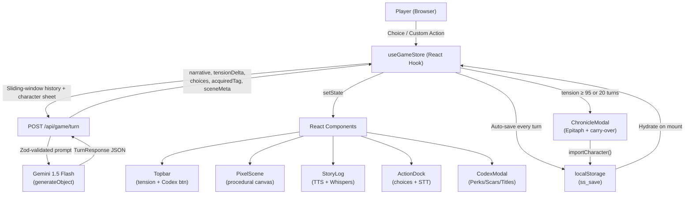

# Scars & Spire

> **A gothic narrative RPG powered by Gemini Flash** — dark choices, earned scars, and a legend that persists.

[](https://nextjs.org)
[](https://www.typescriptlang.org)
[](https://ai.google.dev)
[](https://sdk.vercel.ai)

---

## Overview

*Scars & Spire* is a single-page, AI-driven narrative RPG where every choice is permanent. The player creates a character (archetype + starting scar), then navigates branching gothic fiction narrated live by **Gemini 1.5 Flash**. Each turn the AI returns structured JSON — narrative prose, tension delta, three new choices, and optionally a new Perk, Scar, or Title tag — that the UI renders into an evolving character codex.

**Key experience pillars:**
- 🩸 **Permadeath tension system** — a 0-100 meter that swings with every choice and visually distorts the UI above 70%.
- 📖 **Codex modal** — full character sheet showing all accumulated Perks, Scars, and Titles with descriptions.
- 🏆 **Chronicle / Epitaph** — when Act 3 concludes, a locally-generated epitaph seals the legend, computing a Legacy Score and offering carry-over to higher-tier contracts.
- 💾 **localStorage persistence** — progress auto-saves every turn; hydrates silently on reload.
- 🎨 **Zero-cost procedural canvas** — a pixelated scene rendered via HTML5 Canvas updates biome/lighting/weather from Gemini's `sceneMeta` each turn — no image API calls.

---

## Architecture



### Component Map

| Component | Responsibility |
|---|---|
| `useGameStore` | All game state, API calls, sliding-window history, persistence |
| `PixelScene` | Procedural 192×64 canvas — biome, sky, parallax layers |
| `Topbar` | Character identity, tension meter, Codex button |
| `StoryLog` | Narrative log, TTS toggle, Whispers of Madness (tension > 70) |
| `ActionDock` | Three AI choices, custom text input, STT microphone |
| `CodexModal` | Full Perk/Scar/Title sheet with descriptions |
| `ChronicleModal` | Epitaph, Legacy Score, clipboard export, contract carry-over |
| `/api/game/turn` | Gemini gateway — builds system prompt, calls `generateObject` |
| `lib/persistence` | `saveGame`, `loadGame`, `importCharacter`, `buildChronicle` |

---

## Feature Highlights

| Feature | Detail |
|---|---|
| **Sliding Window Context** | Only the last 2 player/narrator pairs are sent to the API per turn |
| **Zod Schema Enforcement** | `generateObject` constrains Gemini's output to a typed schema — no prompt-parsing |
| **Gemini 1.5 Flash** | Fastest, cheapest Gemini model; ideal for 85-word narrative bursts |
| **Procedural Canvas** | No image generation API — biome scenes drawn in JavaScript at zero cost |
| **Codex Modal** | Tag categorisation (Perk ✦ / Scar ✧ / Title ★) with full descriptions |
| **localStorage Auto-save** | Saves after every `setStateSynced` call; restores on page reload |
| **Chronicle / Epitaph** | Locally-generated epitaph with Legacy Score = `tags × level × tierMultiplier × 10` |
| **Contract Carry-over** | Surviving characters import into Tier II/III contracts via `importCharacter()` |
| **TTS Narrator** | Web Speech API reads each narrative entry aloud; animated voice bars |
| **STT Dictation** | Web Speech Recognition lets players speak custom actions |
| **Whispers of Madness** | At tension > 70: CSS shake + chromatic aberration on the story log |
| **Tension Meter** | Colour-coded (calm → volatile → breaking point) with tick marks |

---

## Token & Cost Optimisation

*Scars & Spire* is engineered to keep API costs as close to zero as possible without sacrificing narrative quality.

### 1 · Sliding Window (`WINDOW_SIZE = 2`)

Rather than feeding the entire conversation history to Gemini, we keep a **rolling buffer of the last 2 player-action / narrator-response pairs** in an in-memory `useRef` (never part of React state). This means:

- Long games stay at a near-constant prompt size regardless of turn count.
- The full character sheet (name, tension, tags, contract) provides persistent world-state context without repeating prose.

### 2 · `generateObject` + Zod Schema

We use Vercel AI SDK's `generateObject` with a Zod schema rather than free-form text generation. This:

- **Forces structured output** — Gemini cannot ramble; every field is constrained (narrative ≤ 85 words, exactly 3 choices of 5-12 words, numeric `tensionDelta` clamped to [-30, 35]).
- **Eliminates JSON-parsing overhead** — the SDK validates and returns a typed `TurnResponse` object directly.
- **Reduces hallucination cost** — fewer tokens wasted on malformed responses that need retries.

### 3 · Gemini 1.5 Flash

`gemini-1.5-flash` is used deliberately over `gemini-pro` or `gemini-ultra`:

- ~10× cheaper per million tokens than Pro.
- Latency is typically under 1 second for 85-word outputs.
- The tight Zod schema compensates for any quality gap — the model's creativity is channelled, not unconstrained.

### 4 · Zero-Cost Procedural Canvas

The atmospheric pixel scene is rendered entirely by the browser using **HTML5 Canvas API**. `PixelScene.tsx` paints a 192×64 buffer scaled up 3×, drawing layered gradients, parallax sprite layers, and animated particles based on `sceneMeta` (biome, lighting, weather) from the last Gemini turn. No image generation API calls, no CDN bandwidth, no cost.

### 5 · Client-side Epitaph

The Chronicle / Epitaph text is generated locally in `lib/persistence.ts` using a seeded phrase bank + character data. The AI is never called at game-end, meaning the most emotionally resonant moment costs $0.

---

## Project Structure

```
scars-and-spire/
├── app/
│   ├── api/game/turn/route.ts   # Gemini API gateway (generateObject)
│   ├── globals.css              # Full design system (design tokens → components)
│   ├── layout.tsx               # Google Fonts injection (Cinzel, Crimson Text)
│   └── page.tsx                 # Root page — phase router (creation/playing/chronicle)
├── components/
│   ├── ActionDock.tsx           # Choice buttons + custom input + STT mic
│   ├── CharacterCreation.tsx    # Theme → archetype → scar → contract flow
│   ├── ChronicleModal.tsx       # Act 3 Epitaph, Legacy Score, carry-over CTAs
│   ├── CodexModal.tsx           # Perk/Scar/Title sheet with descriptions
│   ├── PixelScene.tsx           # Procedural canvas scene renderer
│   ├── StoryLog.tsx             # Narrative log + TTS toggle + Whispers effect
│   └── Topbar.tsx               # Character stats, tension bar, Codex button
├── lib/
│   ├── gameData.ts              # Static data: archetypes, scars, contracts, narratives
│   ├── gameStore.ts             # useGameStore hook — all state, API, persistence
│   ├── mockStore.ts             # Development mock (no API key needed)
│   ├── persistence.ts           # localStorage save/load/import + Chronicle builder
│   └── speech.ts               # TTS + STT browser API wrappers
└── types/
    └── game.ts                  # All TypeScript types (Character, Tag, Contract, etc.)
```

---

## Setup

### Prerequisites

- Node.js ≥ 18
- A [Google AI Studio](https://aistudio.google.com) API key (free tier available)

### 1. Install

```bash
git clone https://github.com/your-handle/scars-and-spire.git
cd scars-and-spire
npm install
```

### 2. Configure environment

Create `.env.local` in the project root:

```env
GOOGLE_GENERATIVE_AI_API_KEY=your_api_key_here
```

> The key is read server-side only by the `/api/game/turn` route. It is never exposed to the browser.

### 3. Run locally

```bash
npm run dev
```

Open [http://localhost:3000](http://localhost:3000).

### 4. Build for production

```bash
npm run build
npm start
```

---

## Design Decisions

### Why a hook-based store instead of Redux / Zustand?

The game state is linear — one character, one log, one contract. A single `useGameStore` hook is sufficient and keeps the bundle small. The pattern also demonstrates clean React state management without third-party overhead.

### Why `useRef` for history instead of state?

The sliding window history is **write-only from the UI's perspective** — nothing re-renders based on it. Storing it in a `ref` avoids unnecessary re-renders on every turn and prevents it from appearing in the persisted save (keeping save files lean).

### Why localStorage over a database?

The game is entirely single-player and client-side. localStorage keeps the architecture serverless-friendly (deployable to Vercel's free tier with no database cost) and gives instant save/load without a round-trip.

### Typography

[Cinzel](https://fonts.google.com/specimen/Cinzel) (display / headings) and [Crimson Text](https://fonts.google.com/specimen/Crimson+Text) (body / narrative) are injected via `next/font` for zero-CLS font loading. The combination evokes medieval manuscripts without being illegible at small sizes.

---

## License

MIT — free to fork, extend, and use as a portfolio piece or game jam starting point.
